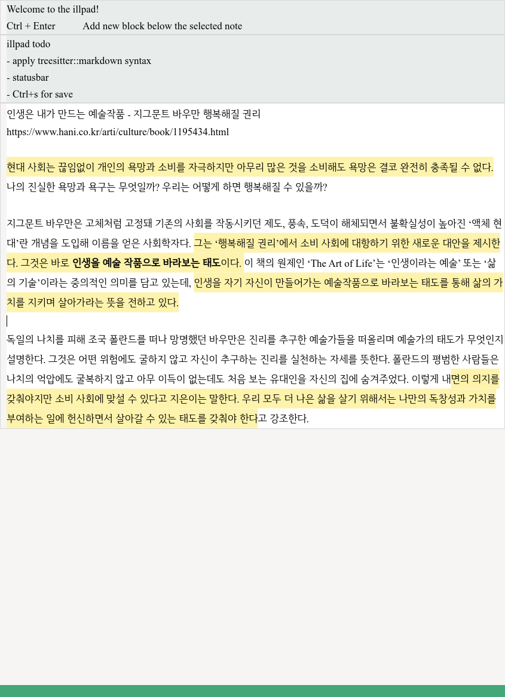

# illpad

A GTK4 scratchpad developed solely for my personal use, utilizing the [relm4](https://relm4.org/) framework and the Rust.

## Why?

I appreciate the idea behind [heynote](https://github.com/heyman/heynote), but I created illpad for the following reasons:

- The startup time of heynote is too long. When using it for quick notes, a faster startup is essential, and the slow startup time of heynote was unbearable.
- As someone who uses [logseq](https://logseq.com/) as a PKM tool, I transfer notes from heynote to logseq at the end of the day. The lack of support for highlight (`==`) and bold (`**`) in heynote was inconvenient.

---

